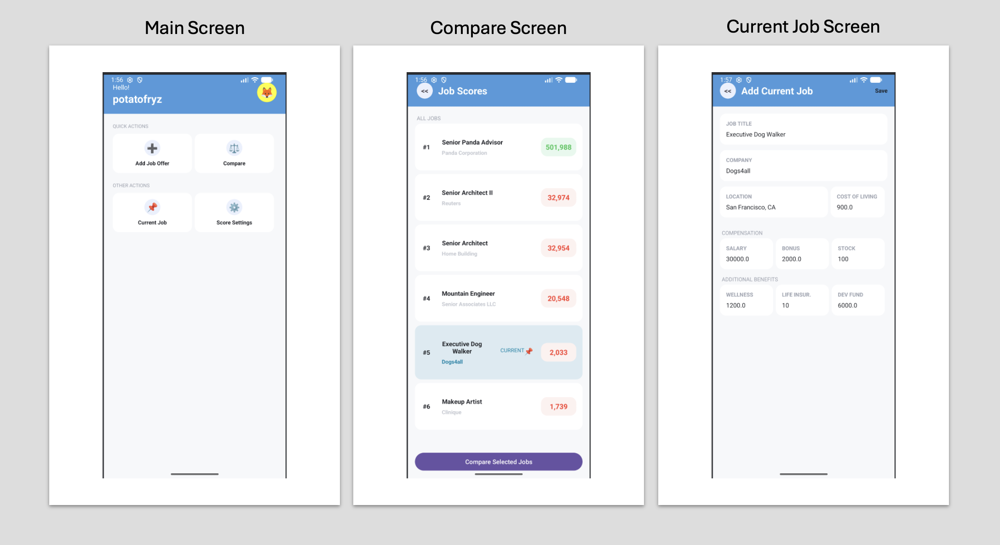

# Job Offer App Overview

### A job offer app created in Android Studio using Java by 4 team members, comparing job elements such as pay, benefits, cost of living.

## Software Development Cycle: 
- **Architectural Design Diagrams:** `Class, component diagrams`
- **User Interface Design:** `Main menu , current job entry, new job offer entry, ranked job list display, pairwise job comparison`
- **Back-end Structure:** `System environment with memory persistence `
- **Testing:** `Integration, system`

## Source Code

Source code is maintained privately in accordance with university academic-integrity requirements.

## Notes
- **Potatofryz Contribution:** *`Documentation, Requirements, GUI development, App Integration, Memory Installation, Testing`*

## Demo

## Technologies

`Java` · `XML` · `Gradle`

